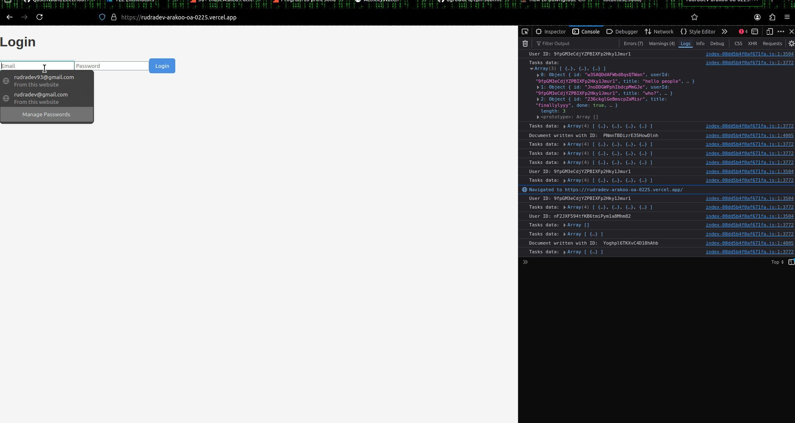

# Rudradevs Arakoo.Ai-0225 Task Board app

## Task List

- [x] Set up Next.js project
- [x] Implement Firebase authentication
- [x] Create task CRUD operations
- [ ] Implement drag and drop functionality
- [x] Add "mark as done" feature
- [x] Style the application for desktop and mobile
- [ ] Write docs
- [x] Write unit tests
- [ ] Implement user profiles
- [ ] Add task categories or tags
- [ ] OAuth 2.0
  
## Features
- User authentication(mayeb add Oauth2 too?)
- Create, read, update, and delete tasks
- Mark tasks as done/undone
- Drag and drop to reorder tasks
- Responsive design for desktop and mobile

### Prerequisites

- Node.js (v14 or later)
- npm
- Firebase account

### Installation

1. Clone the repository:

`git clone https://github.com/RudradevArya/rudradev-Arakoo-OA-0225` 
`cd task-board`

2. Install dependencies:

`npm install`

3. Set up environment variables:
   Create a `.env.local` file in the root directory and add your Firebase configuration:


```NEXT_PUBLIC_FIREBASE_API_KEY=your_api_key NEXT_PUBLIC_FIREBASE_AUTH_DOMAIN=your_auth_domain NEXT_PUBLIC_FIREBASE_PROJECT_ID=your_project_id NEXT_PUBLIC_FIREBASE_STORAGE_BUCKET=your_storage_bucket NEXT_PUBLIC_FIREBASE_MESSAGING_SENDER_ID=your_messaging_sender_id NEXT_PUBLIC_FIREBASE_APP_ID=your_app_id```

4. Run the development server:
`npm run dev`

5. Open [http://localhost:3000](http://localhost:3000) in your browser.


## Testing

Run tests using Jest:

`npm test`

## Deployment

https://rudradev-arakoo-oa-0225.vercel.app/


## Demo


## YouTube Video

[](https://www.youtube.com/watch?v=kC0eeqvl2gM)